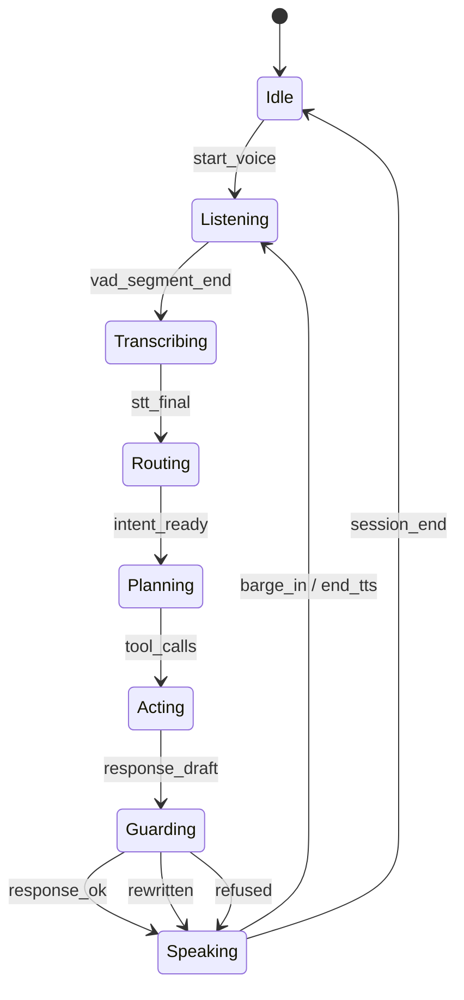

# 小㬢雲（XiaoXiYun）Voice Assistant 技術設計（內網伺服器版）

> 目標：在**不牽涉金流**前提下，提供「語音互動」的目標教練／白話翻譯器／情緒陪跑者；並具備**合規護欄、可追溯、可稽核**的企業級特性。  
> 核心策略：**Voice I/O（STT/TTS）+ 受控工具調用（Tool-based Agent）+ Guardrails + 分層記憶（Session/Profile）**。

---

## 1. 產品/功能範圍（Scope）

### 1.1 In Scope（V1.0）
- 語音輸入（VAD 切段、Barge-in 打斷 TTS）
- STT（語音轉文字）、TTS（文字轉語音）
- Intent Router（意圖分類）
- Tool-based Agent（白名單工具調用，不做自主上網/自主行動）
- Guardrails（風險揭露先行、內容白名單、輸出後置檢查）
- Session Memory（必做）+ Profile Memory（白名單欄位、可刪）
- 事件埋點（對齊 leveling / streak / allies）
- 可觀測性（log/trace/metrics）

### 1.2 Out of Scope（V1.0）
- 真實下單/金流/清算
- 需要正式投顧簽署的完整流程（V1 以模板/教育素材替代）
- 自主型 Agent（自己找資料/自己決策的那種）
- 保存敏感個資或完整 KYC 明細（僅保存偏好與最小必要狀態）

---

## 2. 系統總覽（Architecture）

### 2.1 高層架構
```mermaid
flowchart LR
  U[Client: Web/Mobile Intranet] -->|Audio Stream| GW[API Gateway / WebSocket]
  GW --> VAD[VAD + Segmenter]
  VAD --> STT[STT Service]
  STT --> NLU[Intent Router]
  NLU --> ORCH[Orchestrator / Tool-Agent]
  ORCH --> RAG[RAG / Approved Content Store]
  ORCH --> TOOLS[Toolbox: quest_planner, rephrase, weekly_review, leveling, ally_rewrite...]
  ORCH --> GR[Guardrails]
  GR --> TTS[TTS Service]
  TTS -->|Audio Stream| GW
  ORCH --> MEM[Memory Store: session/profile (whitelist)]
  ORCH --> OBS[Observability: logs/traces/metrics]
  RAG --> KB[(Approved KB / Docs)]
```

### 2.2 服務清單（內網微服務/模組）
- **Gateway**：WebSocket 連線、音訊串流、認證（SSO/Token）
- **VAD/Segmenter**：語音切段、降噪（可選）、Barge-in
- **STT Service**：ASR 轉寫（可本地模型）
- **Intent Router**：意圖分類（rule → classifier）
- **Orchestrator（核心）**：狀態機、工具調用、回覆組裝、事件埋點
- **RAG/Approved Content Store**：核准素材檢索、引用回傳（traceability）
- **Guardrails**：輸入/輸出檢查、風險揭露插入、拒答/改寫
- **TTS Service**：語音合成（可本地模型）
- **Memory Store**：Session 狀態、Profile 偏好（白名單欄位）
- **Observability**：audit log、trace、metrics、dashboard

---

## 3. 互動模式（Voice UX）

### 3.1 對話節奏（建議）
- **先短後長**：先回 1 句總結（<3 秒），再問「要我展開嗎？」  
- **一到兩句停頓**：符合新手理解負擔
- **Barge-in**：用戶插話立即停播 TTS，回到 VAD/STT

### 3.2 典型語音指令（Examples）
- 「我想三年存到一百萬買房」→ 建立目標、拆任務
- 「我今天要做什麼？」→ 今日/本週任務
- 「我聽不懂最大回撤」→ 白話解釋＋換比喻
- 「最近跌很多我好怕」→ 安撫→短版風險揭露→給選項
- 「幫我寫一段鼓勵盟友的話」→ 盟友安全改寫

---

## 4. Intent Router（意圖分類）

### 4.1 意圖列表（V1.0）
| Intent | 說明 | 例句 |
|---|---|---|
| goal_create | 建立/更新人生目標與參數 | 「三年存到100萬」 |
| quest_today | 今日/本週任務與提醒 | 「我今天要做什麼」 |
| explain_plain | 白話解釋/換比喻 | 「這段我聽不懂」 |
| emotion_support | 焦慮/恐慌安撫與冷靜流程 | 「我好怕」 |
| review_weekly | 週回顧、streak、里程碑 | 「幫我回顧這週」 |
| ally_message | 盟友訊息改寫/產生分享卡文案 | 「幫我打氣」 |
| system_help | 使用說明/權限/隱私 | 「你會記住我嗎」 |

### 4.2 Router 實作策略
- **Phase 1（最快）**：規則/關鍵詞 + fallback 到 LLM（低風險）
- **Phase 2（更穩）**：小分類器（內網可部署）+ 置信度門檻
- **Phase 3（成熟）**：多意圖拆解（多輪）、帶 slot filling

Router 輸出格式（示例）：
```json
{
  "intent": "goal_create",
  "confidence": 0.86,
  "slots": {
    "goal_type": "buy_house",
    "target_amount": 1000000,
    "horizon_months": 36
  },
  "language": "zh-TW"
}
```

---

## 5. Tool-based Agent（受控工具調用）

### 5.1 設計原則
- 只允許**工具白名單**，每個工具都有 schema、輸入驗證、原因碼
- Orchestrator 以**狀態機**控制流程（避免 LLM 自己亂跳）
- 高風險輸出（像是「你應該買/賣」）一律走 Guardrails 拒答或改寫

### 5.2 白名單工具（V1.0）
| Tool | 輸入 | 輸出 | 用途 |
|---|---|---|---|
| quest_planner | goal_json | quest_list | 目標拆任務 |
| goal_normalizer | raw_text | goal_json | 生活語言→可計算參數 |
| risk_disclosure | context | disclosure_text | 風險揭露模板 |
| rephrase | text + style | rewritten | 換比喻/白話改寫 |
| weekly_review | events | summary | 週回顧、streak |
| leveling_update | event | profile | 升星/升階 |
| ally_message_rewrite | text | safe_text | 盟友訊息安全改寫 |
| share_card_builder | context | share_card | 分享卡（遮蔽） |

### 5.3 Agent Loop（受控規劃/執行迴圈）
為了把「Chatbot（單輪回答）」升級成「Agent（多步完成任務）」但又維持可控與可稽核，Orchestrator 建議採用固定的迴圈與硬性預算：

- **最大步數**：每次請求最多 `max_steps`（建議 3–6）
- **工具預算**：每次請求最多 `max_tool_calls`（建議 1–3）
- **時間預算**：總耗時超過 `deadline_ms` 直接降級成「只回答不調用工具」
- **輸出策略**：先產出 1 句語音摘要（<3 秒），再補細節（可被打斷）

建議的邏輯（概念示例）：
1) Router 決定意圖與 slots
2) Orchestrator 生成「計畫 plan」（只是一個結構化草案，不直接說給用戶）
3) 逐步執行工具（每步都記錄：原因碼、輸入、輸出、耗時）
4) 組裝回覆草稿 → Guardrails 檢查/改寫/拒答
5) 產生語音輸出與可稽核的 audit log

### 5.4 工具契約（Tool Contract）與版本治理
為了可追溯與可回放，每個工具呼叫建議採用統一的結構：

```json
{
  "tool_name": "quest_planner",
  "tool_version": "1.0.0",
  "input_schema_version": "2026-02-08",
  "correlation_id": "...",
  "reason_code": "intent_goal_create",
  "input": { "...": "..." }
}
```

工具輸出也應帶版本與狀態：
```json
{
  "tool_name": "quest_planner",
  "tool_version": "1.0.0",
  "status": "ok",
  "output": { "...": "..." },
  "latency_ms": 123
}
```

治理建議：
- **Schema 變更需向後相容**（至少保留一個版本的解析器）
- **工具輸入驗證要在 Orchestrator 端做**（避免把垃圾/注入內容丟進工具或 DB）
- **工具需 idempotent**（用 `correlation_id` 去重，避免重試造成重複寫入 XP/事件）

### 5.5 用戶確認（Confirmation）與「非金流行動」護欄
雖然 V1.0 不做金流，但仍可能有「寫入記憶、更新等級、產生分享內容」等可感知行為。

建議規則：
- **寫入 Profile Memory 前必須確認**（語音：「要我把這個偏好記下來嗎？」）
- **會影響成就/等級的事件寫入**：允許自動，但要可回溯與可撤銷（管理端/內部工具）
- **分享卡/盟友訊息**：必須提示「你要直接分享，還是我先給你草稿？」

---

## 6. Guardrails（合規/安全/幻覺防護）

### 6.1 風險揭露先行（Mandatory Disclosure）
規則：任何觸發「投資行為」或「調整建議」語境時，必須先輸出短版揭露：
- 短版（語音）：1 句 + 1 個確認問題
- 長版（可展開）：模板段落（可追溯版本）

### 6.2 內容白名單（Approved Content）
- 回答引用來源需帶：`source_id`、`doc_version`、`retrieved_at`
- 若無核准來源：採「教育性泛化」或拒答

### 6.3 輸出後置檢查（Output Filter）
阻擋/改寫：
- 保證獲利、暗示必賺
- 催促買賣/指定標的（尤其語音更容易誤導）
- 超出核准素材範圍的結論
- 盟友訊息同規則（禁止施壓/指令式）

處置策略：
1) **Rewrite**：改為中性教育語氣  
2) **Refuse**：拒答並提供安全替代（例如「我可以解釋概念」）  
3) **Escalate**：提示轉介真人（若你產品流程允許）

### 6.4 Prompt Injection / 越權防護（內網 RAG/工具調用）
即使在內網，RAG 素材或用戶輸入仍可能包含「忽略規則、請你洩漏系統提示、請你改用未核准資料」等注入指令。

建議增加以下防線：
- **系統提示與工具白名單不可被檢索內容覆蓋**（檢索內容永遠視為「不可信引用」）
- **RAG 引用必須是核准素材**，且每段引用帶 `source_id/doc_version`；沒有引用就只能做「教育性泛化」
- **工具呼叫參數的敏感欄位要做 allowlist**（例如 profile 欄位白名單）
- **拒絕回傳內部實作細節**（例如完整系統提示、內部 policy 規則全文、內網路徑）

### 6.5 Reason Codes（稽核可讀）
建議把 Guardrails 的改寫/拒答理由標準化成 reason codes，方便統計與稽核：
- `investment_advice_request`
- `guaranteed_profit`
- `specific_ticker_or_asset`
- `unapproved_source`
- `prompt_injection_attempt`
- `privacy_or_sensitive_data`

---

## 7. 記憶（Memory）設計：分層 + 白名單

### 7.1 Session Memory（必做）
用途：維持多輪語音對話的狀態  
保存範例（JSON）：
```json
{
  "session_id": "abc",
  "stage": "goal_onboarding",
  "current_goal": { "goal_type": "buy_house", "horizon_months": 36, "target_amount": 1000000 },
  "metaphor_style": "navigation",
  "emotion_state": "concerned",
  "last_intents": ["goal_create","explain_plain"]
}
```

### 7.2 Profile Memory（建議做：白名單欄位 + 可刪）
只保存偏好，不保存金額/資產/完整 KYC：
- `preferred_explanation`: {"plain": true, "detail_level": "medium"}
- `metaphor_preference`: "navigation" | "sports" | "cooking"
- `voice_speed`: "slow" | "normal" | "fast"
- `reminder_frequency`: "weekly" | "biweekly" | "monthly"

寫入規則：
- 需得到用戶同意（語音可問：「要我把這個偏好記下來嗎？」）
- 需提供刪除機制（UI 或語音：「刪掉我的偏好」）

---

## 8. Voice Pipeline（內網伺服器）建議組件

### 8.1 VAD（必做）
- 目的：切段、降低延遲、支援 Barge-in

### 8.2 STT（建議：本地優先）
- 內網部署 ASR，優先採本地模型（Prototype 可先速度優先）

### 8.3 TTS（建議：本地優先）
- Prototype 可先用本地 TTS，後續再升級音色品質

### 8.4 Streaming 與延遲目標
- 端到端目標（理想）：**< 2.5 秒**開始說第一句  
- 技術手段：
  - STT partial transcript（準串流）
  - LLM 先產出 1 句摘要，再補細節
  - TTS 分句播放

---

## 9. API 介面（內網）

### 9.1 WebSocket（推薦）
- `/voice`：音訊雙向串流（PCM/Opus）
- 事件訊息（JSON）：`asr_partial`, `asr_final`, `assistant_text_partial`, `assistant_text_final`, `tts_audio_chunk`, `barge_in`, `error`

### 9.2 REST（輔助）
- `POST /intent/classify`
- `POST /agent/step`
- `GET  /progress/level`
- `POST /progress/xp`
- `POST /ally/rewrite`
- `GET  /content/search`（RAG）

---

## 10. 資料/事件埋點（Observability）

### 10.1 必要事件（對齊你 BDD）
- `voice_session_started` / `voice_session_ended`
- `stt_completed`（含 latency）
- `intent_classified`（intent, confidence）
- `tool_called`（tool_name, input_schema_version）
- `risk_disclosure_shown`
- `guardrail_blocked` / `guardrail_rewritten`（reason_codes）
- `quest_weekly_completed`
- `xp_awarded` / `xp_capped`
- `star_up` / `level_up`
- `ally_message_rewritten`

### 10.2 Audit Log（稽核需求）
- 每次輸出保存：觸發意圖、工具鏈、素材引用、guardrail 結果、版本號
- 便於回溯「為何這樣回答」

### 10.3 建議 Metrics（用來判斷 Agent 是否健康）
- Voice：`e2e_first_audio_ms`、`stt_final_ms`、`tts_first_chunk_ms`、`barge_in_rate`
- Agent：`steps_per_request`、`tool_calls_per_request`、`tool_error_rate`、`fallback_rate`
- Guardrails：`rewrite_rate`、`refusal_rate`、`disclosure_shown_rate`、`reason_code_distribution`
- RAG：`has_citation_rate`、`topk_hit_rate`（若有標註）、`unapproved_source_block_rate`

---

## 11. 安全與權限（內網基線）
- 認證：SSO / JWT / mTLS（依內網標準）
- 授權：RBAC（一般用戶/測試者/管理者）
- Session TTL（例：24h）；Profile 可由用戶刪除
- 傳輸 TLS；儲存加密（若落 DB）
- 進 LLM 前做敏感詞遮蔽（Prototype 可先簡化）

---

## 12. 里程碑（MVP → V1.0 → V1.1）

### MVP（1 週）
- Voice pipeline 串起來（VAD→STT→LLM→TTS）
- 3 intents：goal_create / quest_today / explain_plain
- Guardrails：風險揭露模板 + 禁止保證獲利/指定標的

### V1.0（2–3 週）
- emotion_support（冷靜流程）
- weekly_review + streak + leveling_update
- ally_message_rewrite（安全版）
- audit log + metrics

（建議補入）
- Agent 步數/工具預算（`max_steps/max_tool_calls/deadline_ms`）與降級策略
- Guardrails reason codes 與統計報表

### V1.1（後續）
- Profile memory（白名單欄位、可視化管理）
- 更成熟的 intent classifier
- 更完整 RAG 素材池與引用

（建議補入）
- 離線評估集（golden conversations）與回歸測試
- RAG 素材審核流程（上架/下架/版本）

---

## 15. 測試與評估（讓 Agent 能力可驗證）

### 15.1 離線測試（CI 可跑）
- Intent Router：固定語料的 `accuracy/coverage/confidence calibration`
- Guardrails：針對禁止案例的拒答/改寫單測（含 reason codes）
- Tool Contract：schema 驗證、idempotency、重試與 timeout

### 15.2 對話回歸（Golden Set）
挑選 30–100 條代表性對話（含語音轉文字），每次模型/提示/工具更新都跑：
- 是否展示揭露
- 是否有核准引用（需要時）
- 是否觸發不當建議
- 延遲是否達標（語音摘要能否在目標時間內出來）

### 15.3 壓力與穩定性
- WebSocket 併發、STT/TTS 吞吐、工具 timeout
- 失敗注入：STT 失敗、RAG 無結果、工具超時 → 是否能安全降級

---

## 13. 附錄：狀態機（Conversation State Machine）


---

## 14. 附錄：V1.0 可直接複用的「語音風險揭露短版」
- 「我可以用白話幫你理解風險與選項，但我不會保證獲利，也不會指示你買賣特定標的。要我先用一句話說重點，還是展開細節？」  
（模板版本：`disclosure_voice_short_v1`）
